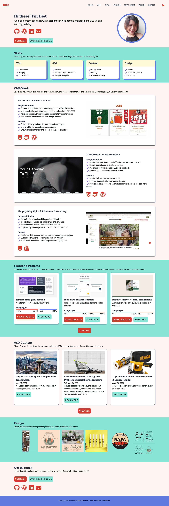

# Live Site URL
[https://dietsalazar.github.io/portfolio/](https://dietsalazar.github.io/portfolio/)

## Screenshots

<strong>Desktop</strong> 

<strong>Mobile</strong> 

## Resources

- Color palette generated on [https://www.realtimecolors.com/](https://www.realtimecolors.com/)
- "Create a Dark Mode Switch with HTML, CSS, JavaScript" by Coding2Go: [https://www.youtube.com/watch?v=_gKEUYarehE](https://www.youtube.com/watch?v=_gKEUYarehE)
- Gallery lightbox: [https://github.com/TheLastProject/CSSBox](https://github.com/TheLastProject/CSSBox)
- Mobile carousel: [https://codepen.io/tutsplus/pen/MWZwrGJ](https://codepen.io/tutsplus/pen/MWZwrGJ)
- W3Schools: [https://www.w3schools.com/](https://www.w3schools.com/)

